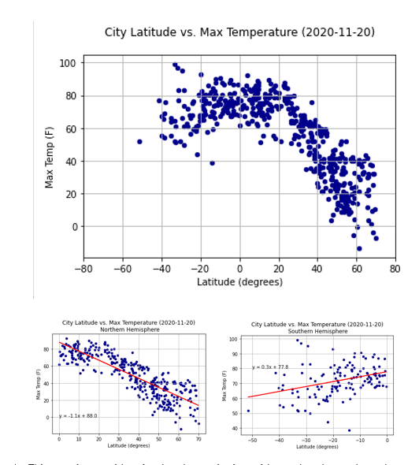

**Weather Pattern Correlation**

This was a brief project to demonstrate the power of data to visualize how
features of the weather are affected by distance from the Earth’s equator.
Although it seems intuitive that on average temperature should increase as one
approaches the equator – after all, there’s a reason for the name The Tropics --
this project provides solid evidence of exactly that.

**Methodology**

For this project, we examined the weather of 500+ randomly selected cities
across the world of varying distance from the equator. We focused on four
weather attributes: temperature, humidity, cloud cover, and wind speed. , these
measurements were sampled only all within about an hour

Using Python and the OpenWeatherMap API, these measurements were sampled only
all within about an hour. So measurements are neither compensated for time of
day or time of year, which necessarily skews the ability to inference. However,
we did timestamp the measurements, so at some future point we could compensate
for time of day and time of year.

**Observations**

1.  This exercise provides visual
    and quantitative evidence that the earth tends to get hotter toward the
    equator. The scatter plots for City Latitude vs. Temperature (2020-11-20),
    and for same variables by just Northern Hemisphere and then by just Southern
    Hemisphere, provide reasonable evidence that temperature and certain other
    weather conditions change with distance from the equator. We note that the
    best time of the year to measure the temperature differential by latitude
    would be on the Spring or Fall Equinox, when the Sun is exactly above the
    Equator and day and night are of equal length in Northern and Southern
    Hemispheres. However, we didn't have the luxury of being able to gather
    temperatures on those dates or to take multiple weather readings around the
    world over a year long period, which would have given us another method of
    capturing information that could cancel out effects of the earth's axis
    running at a 22 degree angle to the solar ecliptic. That said, with the
    understanding that it is now two months since the Fall Equinox, what we find
    is that in the Northern Hemisphere, currently in the Fall season, the
    scatter plot shows a relatively tight concentration of temperature-latitude
    data points that describe temperatures falling as latitudes increase from
    the equator toward the poles (north pole in this case). The Southern
    Hemisphere temperature-latitude data points also describe a falling off as
    latitudes increase from the equator toward the poles (south pole in this
    case). But the Southern Hemisphere's rate of falling off is both not as
    great and seems less tightly concentrated as that for the Northern
    Hemisphere. The Northern Hemisphere temperature-latitude slope we calculated
    is -1.1 while the Southern Hemisphere temperature-latitude slope we
    calculated is 0.3. The difference likely reflects the longer duration of
    daylight in the Southern Hemisphere, but to prove this hypothesis, we would
    probably want to study more temperature readings at more dates through the
    year. And maybe through some number of years. We also observe that the
    latitude of cities in our sample in the Southern Hemisphere is relatively
    more tightly concentrated; they range generally between 0 degrees (equator)
    and 40 degrees South. By contrast, latitude of cities in our sample in the
    Northern Hemisphere is relatively more spread out; they range generally
    between 0 degrees (equator) and 70 degrees North. We also note that the
    Northern Hemisphere has 68% of the Earth's land by area, while the Southern
    Hemisphere has 32%, and that the land makes up only 29% of the planet's
    crustal surface. We believe this reflects the study methodology of selecting
    a random sample of cities, and then taking temperatures for them. We believe
    a further important major factor for consideration is that large bodies of
    water generally tend to take longer to heat or to cool than does the land.
    The temperatures of such large bodies of water affect ambient weather
    conditions not only over the water but also certainly over coastal regions
    and very likely well beyond. The ratio of land surface area to water surface
    area in the Northern Hemisphere is 7:10 while that ratio is 3:10 in the
    Southern Hemisphere.

2.  The scatter plots City
    Latitude vs. Humidity (2020-11-20) by total earth and then for each
    hemisphere separately seemed somewhat to describe a similar effect as for
    temperature. The closer the latitude to the equator the higher the mean and
    median humidity measurement. Or at least one could say the fewer outliers
    with low humidity. However, the Northern Hemisphere deviated from this
    inferential rule of thumb. Above about 40 degrees North, humidity
    measurements concentrated at increasingly higher measurements (approaching
    100 percent, the maximum). One other aspect should be mentioned. At least
    visually, the humidity-latitude scatter concentrations did not track or
    concentrate as strongly as they did the temperature-latitude plots.
    Separately, we note that none of the weather readings we gathered reported
    any measurements above 100%, which would have called into question their
    veracity.

1.  The scatter plots City
    Latitude vs. Cloudiness (2020-11-20) by total earth and then for each
    hemisphere separately seemed less conclusive. There were also patterns in
    the data that seem to be methodology driven. Concentrations at 100%, 75%,
    40%, 20%, and 0% suggest that cloud cover readings may be human eyeballed
    rather than measured by radar or some other optical measurement, in that
    these seem to reflect quantified translations of the way that cloud cover is
    typically reported: cloudy, clear, partly cloudy, etc.

1.  The exercise also had us run
    plots and calculate regression lines for wind speed. These include the
    scatter plots City Latitude vs. Wind Speed (2020-11-20) by total earth and
    then for each hemisphere separately. The regression lines suggest a gradual,
    slight, but not insignificant increase in average wind speed as latitude
    increases from the equator. The Southern Hemisphere slope was 0.8 while the
    Northern Hemisphere slope was 0.1, suggesting the wind speed increases at a
    greater rate in the Southern Hemisphere. We speculate that this correlates
    to the season of the year, in that greater sunlight hours in the Southern
    Hemisphere energizes average wind speed more greatly than regions of the
    earth with shorter sunlight hours. It could also possibly represent the
    greater proportion of water surface area to land surface area in the
    Southern Hemisphere, with fewer mountains as a percentage of total surface
    area to impede or slow wind. The final observation here is that there may be
    evidence of the trade winds imbedded in the data. I speculate these are
    popping out in the outliers in slight concentrations around certain
    latitudes. Since the trade winds at specific latitudes tend to move either
    east-to-west or west-to-east, there would seem to be a slightly higher
    average wind speed since in other areas of the world, wind direction shifts
    quite a bit more, with correspondingly significant disruption to average
    wind speed.

2.  Since 71% (we used 2/3 as the
    approximation in the Jupyter Notebook) of the surface area of the globe is
    water, there is a likelihood that 71% of the choices made by randomly
    selecting geocoordinates will be somewhere other than on land, which means
    that at least 71% of the cities selected by using random coordinates will be
    clustered on shorelines. Bottom line, the real task is to randomly select
    geocoordinates only for the 29% of the planet surface that is land. Our
    solution rejected any cities that were greater than 60 miles from the
    randomly chosen geocoordinates. This required us to measure the distance
    from the randomly chosen geocoordinates to the nearest city selected. We
    used the trigonomic Haversine Formula to calculate these distances. The
    original search for the nearest city involved 1,500 random geocoordinates.
    This yielded just over 200 cities that were less than or equal to 60 miles
    from the original random geocoordinates. As a result, we \# expanded our
    random geocoordinates set by a factor of 2x or higher to increase the odds
    of selecting at least 500 target cities that were within the maximum 60-mile
    search radius. So, we reran the next time with 3,500 random geocoordinates.
